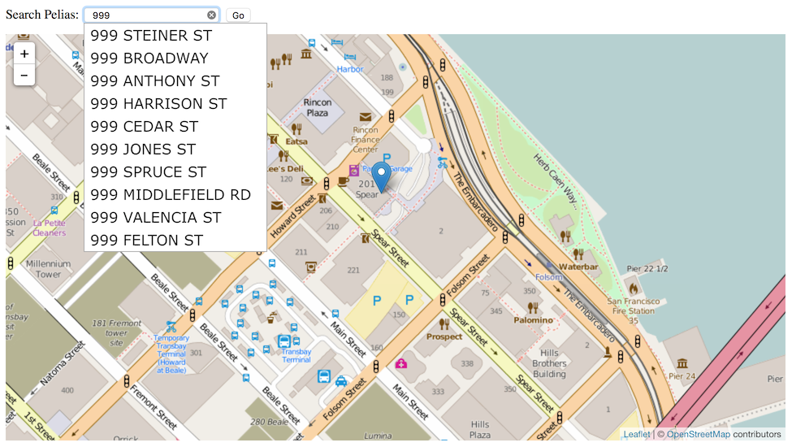

Pelias
======

Ubuntu meta-package for [Pelias geocoder](https://github.com/pelias),
an open source distributed full-text geographic search engine sponsored
by [Mapzen](http://mapzen.com). More information about the motivation
behind this package and current plans can be found in
[Ops issue #12](https://github.com/openaddresses/openaddresses-ops/issues/12).

[Pelias Front Page](https://github.com/openaddresses/pelias-frontpage-ubuntu-xenial)
provides an interactive index page for autocomplete and address search:

Install
-------

Pelias is distributed for Ubuntu version 14.04 via the
[`openaddresses/geocoder` PPA](https://launchpad.net/~openaddresses/+archive/ubuntu/geocoder).

    # Tell Ubuntu where to find packages:
    add-apt-repository ppa:openaddresses/geocoder -y
    wget -qO - https://packages.elastic.co/GPG-KEY-elasticsearch | apt-key add -
    echo "deb http://packages.elastic.co/elasticsearch/1.7/debian stable main" | tee -a /etc/apt/sources.list.d/elasticsearch-1.7.list
    
    # Install Pelias and dependencies:
    apt-get update && apt-get install pelias

These dependencies will be installed:

* [Pelias API](https://github.com/openaddresses/pelias-api-ubuntu-xenial)
* [Pelias Front Page](https://github.com/openaddresses/pelias-frontpage-ubuntu-xenial)
* [Pelias OpenAddresses Adapter](https://github.com/openaddresses/pelias-openaddresses-ubuntu-xenial)
* [Pelias Schema](https://github.com/openaddresses/pelias-schema-ubuntu-xenial)
* [Elasticsearch database](https://www.elastic.co/products/elasticsearch)
* [Java OpenJDK 8](http://openjdk.java.net)
